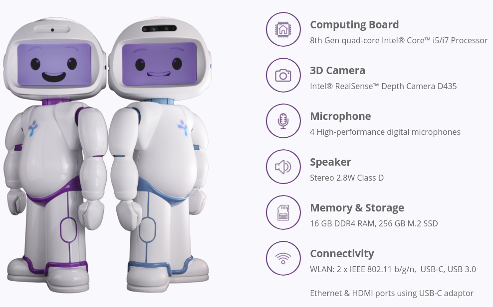

# Tutorials
This repository contains a set of code samples and tutorial for programming [QTrobot by LuxAI S.A.](http://luxai.com/qtrobot-for-research/#hardware)

[**Examples**](examples/)
---
* [**Motor**](examples/#Motor) : contains robot motors related examples
* [**Voice**](#Voice) : contains voice direction and recognition examples
* [**Interfaces**](#Interfaces) : contains robot standard interfaces (speecch, gesture,...) examples   
* [**Vision**](#Vision) : contains robot visual perception examples

[**Demos**](demos/)
---
* [**Range of Motion & DOF**](demos/qt_range_of_motion/) : contains motor movement demo
* [**Far-Field Microphone Array - Voice direction**](demo/qt_microphone_recognition/) : contains voice direction demo
* [**Far-Field Microphone Array - Voice recognition**](demo/qt_microphone_direction/) : contains voice recognition demo
* [**Image recognition - Emotion Game**](demo/qt_emotion_game/) : contains image recognition emotion demo   
* [**Image recognition - Memory Game**](demo/qt_memory_game/) : contains image recognition memory demo   
* [**3D Camera - Gesture recognition**](demo/qt_gesture_recognition/) : contains 3D camera gesture recognition demo
* [**3D Camera - Face recognition, Age & Gender**](demo/qt_face_recognition/) : contains 3D camera face recognition demo
* [**3D Camera - Skeleton Tracking**](demo/) : contains 3D camera skeleton tracking recognition demo (todo)
